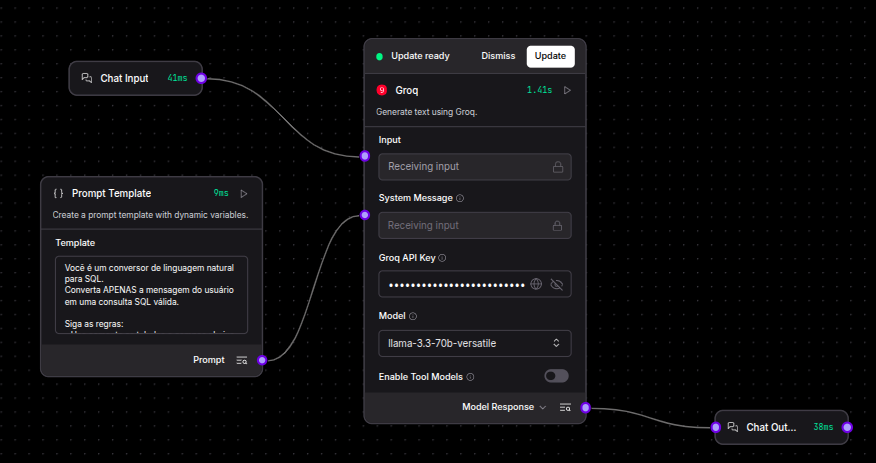

## 🔍 Agente Text-to-SQL: 

Conversor Inteligente de Linguagem Natural para SQL.

Este projeto implementa um agente de IA que traduz consultas em português  para comandos SQL válidos. O pipeline foi construído visualmente no Langflow e containerizado com Docker, simulando uma interface de consulta a bancos de dados relacionais.


## 📋 Índice

* [✨ Funcionalidades](#-funcionalidades)

* [🛠️ Tecnologias Utilizadas](#-Tecnologias-Utilizadas)

* [📁 Estrutura do Projeto](#Estrutura-do-projeto)

* [🖼️ Arquitetura do Flow](#Arquitetura-do-Flow)

* [🚀 Instalação e Execução](#Instalação-e-execução)

* [📖 Exemplos de Uso](#Exemplos-de-Uso)

## ✨ Funcionalidades
### 1. Tradução Inteligente

- Converte perguntas em português coloquial para comandos SQL válidos
- Suporta consultas simples, filtradas, agrupadas e com joins
- Mantém a semântica da intenção original do usuário

### 2. Contextualização com Schema
- Inclui estrutura completa do banco no contexto do LLM
- Especifica tipos de dados, chaves primárias e estrangeiras
- Fornece exemplos de relações entre tabelas

### 3. Pipeline Visual no Langflow
- Fluxo completo construído via interface gráfica
- Componentes modulares e reutilizáveis
- Fácil depuração e ajuste de parâmetros

### 4. Containerização Completa
- Ambiente isolado e reproduzível
- Dependências gerenciadas automaticamente
- Configuração simplificada via Docker Compose

### 5.  Output Limpo e Executável
- Gera apenas código SQL puro
- Remove texto explicativo e markdown
- Formatação padronizada para legibilidade

## 🛠️ Tecnologias Utilizadas

- **Langflow** - Plataforma visual para construção de fluxos LLM
- **LangChain** - Framework para orquestração de aplicações LLM
- **llama 3.3-70b versatile** - LLM principal para tradução Text-to-SQL
- **Docker** - Containerização e orquestração da aplicação


## 📁 Estrutura do projeto
```
agent-text-to-query/
├── assets/                  # Diretório para imagens
│   └── Flow-diagram.png     # Imagem do canvas de fluxo do projeto 
├── flow/                    # Diretório para arquivos que definem o fluxo ou pipeline
│   └── chat.json            # Configuração do fluxo de chat em formato JSON
├── docker-compose.yml       # Configuração para orquestração de contêineres Docker
└── README.md                # Documentação principal do projeto(este arquivo)
```

## 🖼️ Arquitetura do Flow (Langflow Canvas)

A arquitetura do projeto é baseada em uma cadeia simples e eficiente de **Processamento de Prompt**, onde a entrada do usuário é combinada com o contexto do banco de dados antes de ser enviada ao Modelo de Linguagem. 

 

### Detalhamento dos Componentes (Nodes)

| Componente (Node) | Função no Pipeline | Configuração |
| :--- | :--- | :--- |
| **Text Input** | Recebe a consulta do usuário em linguagem natural. | Variável de entrada mapeada no Prompt. |
| **Prompt Template** | É responsável por combinar o contexto recebido e a consulta realizada no input de entrada. | O template instrui o LLM a atuar como um um tradutor SQL e injeta a estrutura de tabelas. |
| **LLM (Language Model)** | Processa o prompt instruído e gera a query SQL resultante. | Modelo llama 3.3-70b.
| **Chat Output** | Exibe a query SQL gerada pelo modelo de volta ao usuário. | Exibe na interface a consulta resultante correspondente semânticamente com o input de entrada.

## 🚀 Instalação e Execução

### Como Usar

 1. Inicie os serviços Docker
Na raíz do projeto, execute para a criação do conteiner do ElasticSearch e Kibana.
```bash
docker-compose up -d
```

2. **Clone o repositório**
```bash
git clone https://github.com/vialbuquerquz/agent-text-query.git
cd agent-text-to-query
```

3. Aguarde alguns instantes e acesse o Langflow no seu navegador através do endereço:

 http://localhost:7860


## 📖 Exemplo de Uso

#### Entrada do Usuário:

"Liste todos os clientes que moram no estado de São Paulo"

####  Saída esperada:

```
SELECT * FROM CLIENTES WHERE estado = 'São Paulo'
```
